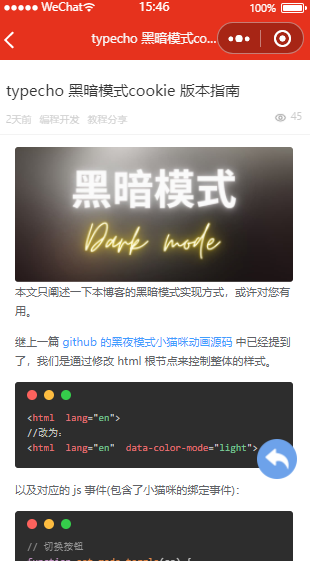
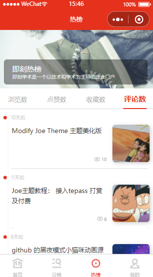

# OneTypecho

Hi，欢迎使用“酱茄小程序开源版 二开 typecho – 即刻学术小程序”。

>酱茄小程序开源版基于WordPress开源程序和WordPress REST API开发，实现WordPress网站数据与小程序数据同步共享，通过简单的配置就能搭建自己的小程序。

基于 人人咖啡师 二次开发 修改为 typehco 专用

安装文档/常见问题：[https://geekscholar.net/archives/76/](https://geekscholar.net/archives/76/)

————————————【原作联系/版权】————————————

微信客服：jianbing2011 （如要加入微信群请说明）

技术支持：www.jiangqie.com

下载安装：https://www.jiangqie.com/ky

开源协议：The MIT License (MIT)

Copyright © 2020 酱茄 jiangqie.com

在此对提供开源及创意表示致谢，开源声明关注酱茄官网。

## 演示

## 联系&赞赏
